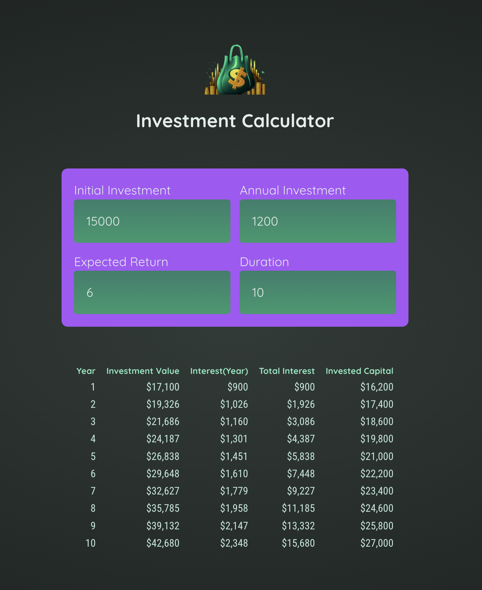

The task was:

- Build an Investment Calculator" web app
- Add components for displaying a header, fetching user input & outputting the results table
- Fetch & store user input (i.e., the entered investment parameters)
- Derive investment results with help of the provided utility function (in the starting project)
- Display investment results in a HTML table (use < table>, <thead>, <tbody> <tr>, <th>, <td>)
- Conditionally display an info message if an invalid duration (< 1) was entered

Added by myself:

- Typescript
- TailwindCSS

## Screenshot

